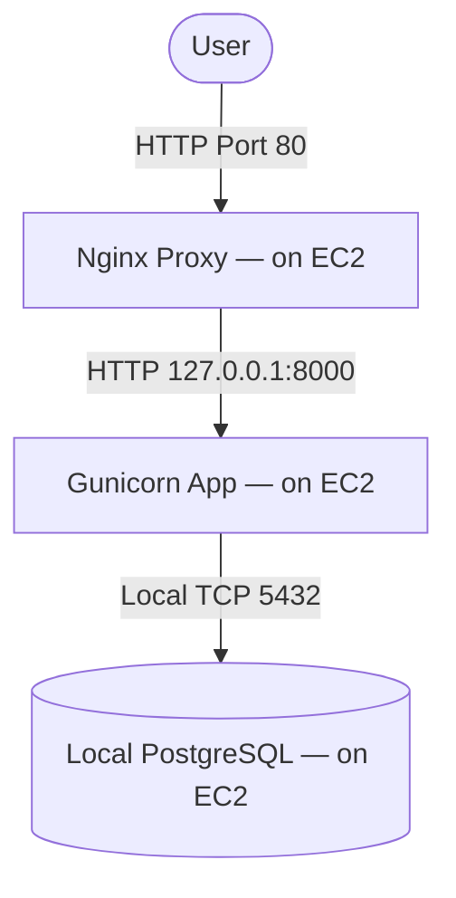
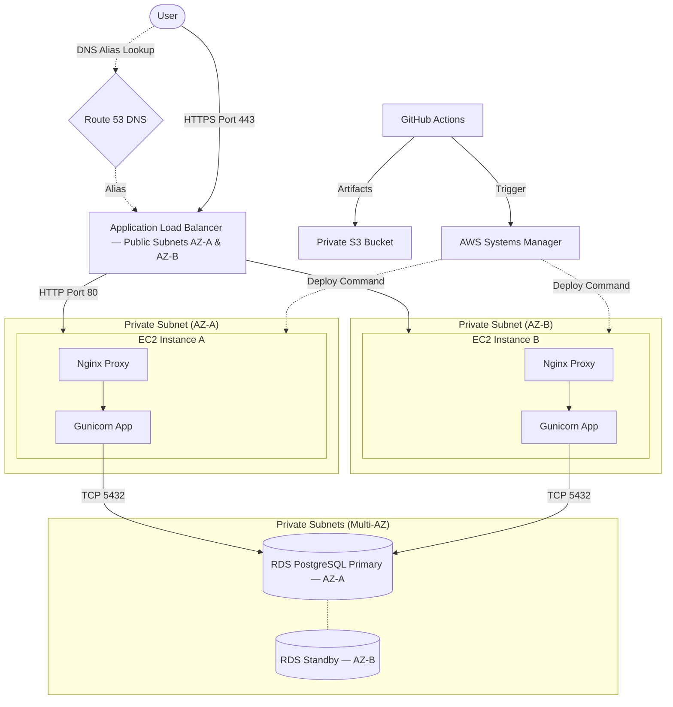

# Platform Engineer – Technical Assignment Submission

**Candidate:** Pritam Shende  
**Date:** October 2026  
**Repository:** [https://github.com/pritamshende/Platform-dj-jango](https://github.com/pritamshende/Platform-dj-jango)  
**Submission Index (Google Sheet):** *[Insert Public Google Sheet URL Here]*

---

## Executive Summary

**Status:** The demo checks listed below are candidate-reported. The CI/CD workflow and production infrastructure are proposed; they have not been validated by this document review.
This document serves as the complete submission for the Platform Engineer Technical Assignment. It covers the end-to-end deployment strategy, CI/CD pipeline design, incident troubleshooting protocols, security analysis, health-check implementation, and AWS architecture. 

A live demonstration environment has been provisioned on EC2. All deliverables comply with the requirement of omitting confidential company information or hardcoded credentials. 

---

## Part 1: Deployment Approach & Execution

The deployment design uses separate release directories. Each deployment creates a new, isolated directory containing a fresh Python virtual environment. The application is served by Gunicorn running as a `systemd` service, with Nginx acting as a reverse proxy. 

### 1.1 Live Environment Setup Commands
The following commands were executed to provision the live Ubuntu EC2 instance. **The demonstration uses local PostgreSQL. The production design uses private RDS PostgreSQL.** Additionally, in the demo configuration, Nginx serves traffic directly over HTTP. In the proposed production architecture, HTTPS terminates at the ALB, which forwards HTTP to Nginx.

**1. System Packages & User Setup:**
```bash
sudo apt update
sudo apt install -y python3-venv python3-pip nginx postgresql postgresql-client curl jq rsync libpq-dev python3-dev build-essential
sudo useradd --system --home /opt/platform --shell /usr/sbin/nologin platform
```

**2. Directory Structure & Permissions:**
```bash
sudo install -d -o root -g platform -m 0750 /etc/platform
sudo install -d -o root -g root -m 0755 /opt/platform/releases
sudo install -d -o platform -g platform -m 0750 /var/lib/platform
sudo install -d -o platform -g platform -m 0755 /var/lib/platform/static
# Grant read traversal to all local users, allowing www-data to serve static files
sudo chmod o+rx /var/lib/platform /var/lib/platform/static
```

**3. Database Configuration (Local Postgres for Demo):**
```bash
sudo -u postgres psql -c "CREATE DATABASE platform;"
sudo -u postgres psql -c "CREATE USER platform_app;"
# Set the password interactively to avoid leaking credentials in command history:
sudo -u postgres psql -c "\password platform_app"
sudo -u postgres psql -c "ALTER ROLE platform_app SET client_encoding TO 'utf8';"
sudo -u postgres psql -c "ALTER ROLE platform_app SET default_transaction_isolation TO 'read committed';"
sudo -u postgres psql -c "ALTER ROLE platform_app SET timezone TO 'UTC';"
sudo -u postgres psql -c "GRANT ALL PRIVILEGES ON DATABASE platform TO platform_app;"
sudo -u postgres psql -d platform -c "GRANT ALL ON SCHEMA public TO platform_app;"
```

**4. Environment Variables & Security:**
Runtime configuration is loaded from `/etc/platform/platform.env`. Root ownership and mode 0600 restrict access to the file. Secrets are excluded from Git and must also be redacted from application and deployment logs.

**5. Application Server & Proxy Configuration:**
*   **Gunicorn:** Managed via `systemd` (`ops/platform.service`), running under the restricted `platform` user.
*   **Nginx (Demo Configuration):** Configured (`ops/platform-nginx.conf`) to proxy traffic to Gunicorn on port 8000, and serve static assets directly from `/var/lib/platform/static`. Behind an HTTPS ALB in production, Nginx would use the trusted `X-Forwarded-Proto` header, and Django would configure `SECURE_PROXY_SSL_HEADER = ('HTTP_X_FORWARDED_PROTO', 'https')`.

**Deployment prerequisites:** Install AWS CLI v2 and verify `aws --version` before using the S3 deployment script. Install the service unit and Nginx site, disable the distribution default Nginx site if it conflicts, and create the initial release/current symlink before starting the service. The maintenance script requires administrator privileges; the application service runs as `platform`.

**6. Service Startup:**
```bash
sudo systemctl daemon-reload
sudo systemctl enable --now platform
sudo nginx -t && sudo systemctl reload nginx
```

### 1.2 Django Settings and URL Registration
The Django application is securely decoupled from its configuration.
- **`urls.py`**: Explicitly registers the health checks alongside the admin panel.
```python
from django.contrib import admin
from django.urls import path
from .health import live, ready

urlpatterns = [
    path("admin/", admin.site.urls),
    path("health/live/", live, name="health-live"),
    path("health/ready/", ready, name="health-ready"),
]
```
- **`settings.py`**: Parsed dynamically via `config()` (python-decouple) to prevent hardcoded secrets. 
```python
from decouple import config, Csv

DEBUG = config("DJANGO_DEBUG", default=False, cast=bool)
SECRET_KEY = config("DJANGO_SECRET_KEY")
ALLOWED_HOSTS = config("DJANGO_ALLOWED_HOSTS", cast=Csv())
# Database uses a connection timeout
DATABASES = {
    "default": {
        "ENGINE": "django.db.backends.postgresql",
        "NAME": config("DB_NAME"),
        "USER": config("DB_USER"),
        "PASSWORD": config("DB_PASSWORD"),
        "HOST": config("DB_HOST", default="localhost"),
        "PORT": config("DB_PORT", default="5432"),
        "OPTIONS": {"connect_timeout": 5},
    }
}
STATIC_ROOT = BASE_DIR / "staticfiles"
```
- **Static files**: `STATIC_ROOT` is set to the release directory temporarily. `deploy.sh` runs `collectstatic`, writing assets to the isolated release directory first, then uses `rsync` to sync them into the shared `/var/lib/platform/static` directory served by Nginx.

### 1.3 Deployment Control & Rollback Approach
If a deployment fails `manage.py check --deploy`, the process is stopped before activation, keeping the current release active. If post-activation automated health checks fail, the `deploy.sh` script automatically re-points `/opt/platform/current` to the previous working release directory, restarts the `systemd` service, and verifies the rollback's health. 

*Known Limitations:* 
- **Static-file rollback:** Shared static files are updated before activation, but the rollback script restores only application code. In production, this requires the use of compatible/versioned assets so that older releases remain compatible with newly collected static assets.
- **Additive Migrations:** Migrations are reviewed for backward compatibility. Code rollback proceeds only when the previous release remains compatible with the updated schema.

---

## Part 2: CI/CD Pipeline Architecture

A comprehensive CI/CD pipeline was designed using **GitHub Actions** (see detailed workflow code in the Appendix). **Note: This pipeline is proposed and untested; its AWS resource placeholders and example hostnames are not executable deployment values.**

### Pipeline Workflow:
1.  **Trigger:** Initiates automatically on `main`.
2.  **Test:** Spins up a PostgreSQL service container (using a disposable CI test password), and runs Django tests.
3.  **Secure Authentication:** Uses OIDC to authenticate with AWS.
4.  **Artifact Creation:** Packages the source code into a commit-tagged archive and uploads it to S3.
5.  **Deployment (AWS SSM):** Invokes the `Platform-Deploy` SSM Run Command to execute the deployment script. The deployment script handles:
    * Dependency installation (`pip install -r requirements.txt`)
    * Database migrations (`manage.py migrate`)
    * Application restart (`systemctl restart platform`)
6.  **Verification:** The pipeline pings the ALB health endpoint and explicitly waits for a `Success` status.
7.  **Rollback:** The deployment script handles service-restart failures and failed local readiness checks. If SSM deployment succeeds but external verification fails, the pipeline invokes `Platform-Deploy-Rollback` and waits for its result. If the SSM waiter fails or times out, investigate the remote command status before further changes; the example pipeline stops rather than starting a concurrent rollback.

*Known Pipeline Limitations:*
- **SSM Timeout:** A waiter timeout does not prove the remote deployment actually stopped. The pipeline must inspect the remote status before issuing another deployment or rollback.
- **Two-instance rollout:** The example pipeline deploys to a single instance. In a highly available production rollout, the pipeline should drain, deploy, and verify one target at a time.

---

## Part 3: Production Incident Investigation (502 Bad Gateway)

A 502 response indicates that a gateway or proxy could not obtain a valid response from its upstream. I would first identify whether the response originated from the ALB or Nginx, then check the application service, upstream connectivity and logs.

### Troubleshooting Protocol & Common Root Causes

**1. Service Status Checks & Worker Crashes/OOM:**
```bash
sudo systemctl status platform --no-pager
```
*Cause:* Out of Memory (OOM) killer terminated Gunicorn workers, or the application crashed on boot due to a missing dependency.

**2. Application Log Investigation (Missing Configuration):**
```bash
sudo journalctl -u platform -n 150 --no-pager
```
*Cause:* Missing environment variable causing a fatal Python exception, or database credentials changed without updating the `.env` file.

**3. Nginx Log & Permission Investigation (Connection Refusal):**
```bash
sudo tail -n 100 /var/log/nginx/error.log
sudo tail -n 100 /var/log/nginx/access.log
namei -l /opt/platform/current/.venv/bin/gunicorn
```
*Cause:* Gunicorn service is stopped. *Note on permissions:* Release directory permissions affect the **Gunicorn service user** which needs execution rights to boot, while static-file directory permissions affect **Nginx** which serves them directly. Nginx connects to Gunicorn over TCP, so it does not need access to the release directory to reach the upstream.

**4. Upstream Checks (Wrong Upstream Port):**
```bash
sudo ss -lntp | grep 8000
curl -i --connect-timeout 3 --max-time 5 -H "Host: platform.example.com" http://127.0.0.1:8000/health/live/
```
*Cause:* Gunicorn binds to an unexpected port or interface, causing Nginx proxy passes to time out or fail.

**5. Safe Recovery & Rollback:**
If the issue was introduced by a recent deployment, perform a compatible rollback. Repoint `/opt/platform/current` to the previous working release directory, restart the `systemd` service, and manually verify the application is fully operational by pinging the readiness endpoint. Investigate the faulty release in a staging environment.

---

## Part 4: Security Review

The following operational and security controls are defined for this architecture. 

**Implemented Controls (Live Demo):**
1.  **Application running as root:** Mitigated by creating a dedicated `platform` user with a `nologin` shell. systemd starts Gunicorn directly under this account.
2.  **Weak Linux permissions:** `systemd` unit hardened with `NoNewPrivileges=true`, `ProtectSystem=strict`, and `PrivateTmp=true`.
3.  **Secrets stored in source code:** Excluded from git; injected securely via `/etc/platform/platform.env`.
4.  **Debug mode enabled:** `DJANGO_DEBUG` is forced to `False`. 

**Proposed Production Controls (Not Deployed in Demo):**
5.  **Overly permissive IAM access:** Segment IAM roles (GitHub OIDC vs. EC2 Profile) adhering to the principle of least privilege.
    * *GitHub OIDC Role:* Permitted to upload to the designated S3 artifact prefix, invoke only the approved SSM documents on intended instances, and inspect command results using `ssm:GetCommandInvocation`. The OIDC trust policy strictly limits access to the repository (`pritamshende/Platform-dj-jango`) and the GitHub deployment environment (`production`).
    * *EC2 Instance Role:* Permitted to download from the designated S3 artifact prefix, write the intended CloudWatch logs/metrics, and use Systems Manager through the required managed-instance permissions. Private instances need service connectivity through VPC endpoints or an appropriate outbound path.
6.  **Open security group ports:** Disable SSH (port 22) from the internet. Administration handled via AWS SSM Session Manager.
7.  **Publicly exposed database:** The production RDS instance will reside in a private subnet. 
    * *Security Group Inbound Rules:* ALB SG allows `443` from approved client networks (or `0.0.0.0/0` only when public access is intended), plus `80` from the same sources solely for HTTPS redirection. EC2 SG allows `80` from ALB SG. RDS SG allows `5432` from EC2 SG.
8.  **Missing SSL:** For the proposed architecture, HTTPS terminates at the ALB. An ACM certificate is requested, validated via Route 53 DNS, attached to the ALB HTTPS listener, and a rule is added to redirect all HTTP (port 80) traffic to HTTPS (port 443). The ALB then forwards decrypted HTTP traffic to Nginx within the VPC; this leg is not encrypted. Use HTTPS target connections if end-to-end transport encryption is required.

---

## Part 5: Health-Check Endpoint Implementation

### Health-Check Source Code (`config/health.py`)
```python
import logging
from django.db import DatabaseError, connection
from django.http import JsonResponse
from django.views.decorators.http import require_GET

logger = logging.getLogger(__name__)

@require_GET
def live(request):
    """Liveness probe: verifies WSGI process is responding."""
    return JsonResponse({"status": "ok"})


@require_GET
def ready(request):
    """Readiness probe: verifies PostgreSQL connectivity."""
    try:
        with connection.cursor() as cursor:
            cursor.execute("SELECT 1")
            cursor.fetchone()
    except DatabaseError:
        logger.exception("Readiness database check failed")
        return JsonResponse(
            {"status": "unavailable", "database": "unreachable"},
            status=503,
        )
    return JsonResponse({"status": "ok", "database": "ok"})
```
*   **Liveness Probe (`/health/live/`):** Returns HTTP `200 OK` `{"status": "ok"}`. Intended for the proposed ALB health check to verify the web server is running.
*   **Readiness Probe (`/health/ready/`):** `/health/ready/` checks PostgreSQL connectivity using `SELECT 1`. It returns HTTP 200 when the check succeeds and HTTP 503 when it fails. The deployment process uses this endpoint to verify readiness before marking a release successful.

---

## Part 6: AWS Architecture & Observability

### Architecture Diagrams

#### View 1: Live Demo


#### View 2: Proposed Production


### Observability, Monitoring Alerts, and Backups
*   **CloudWatch Agent:** Installed on EC2 to stream application and Nginx logs.
*   **Critical Alerts:** Delivered to PagerDuty/Slack via SNS:
    *   *Unhealthy Targets:* ALB reporting instances failing liveness checks.
    *   *Application Errors:* Spike in 5xx HTTP responses.
    *   *Resource Exhaustion:* EC2 CPU/Memory > 85%, or Disk Space < 15%.
    *   *Database:* RDS Freeable Memory dropping, or connection limits reached.
*   **Disaster Recovery:** RDS Automated Backups are retained for 7 days. A documented restore-test procedure involves spinning up a snapshot into a staging environment monthly to verify data integrity and RTO.

---

## Deployment Verification

**Deployment verification:**  
Demo URL: `http://54.90.203.106/health/live/` and `http://54.90.203.106/health/ready/`  
Deployed commit: manual initial release; no Git commit recorded.  
Checks completed: Nginx HTTP proxy verification, Gunicorn liveness check, PostgreSQL readiness connectivity check.  
Rollback test: tested manually via symlink swap; automated rollback not yet triggered by failure.  
Production architecture: proposed design; resources not deployed in the demonstration (ALB, RDS, SSM Session Manager) are identified separately above.

---
---

## Appendix: Source Code Deliverables

*(All deliverables are also accessible via the repository URL: https://github.com/pritamshende/Platform-dj-jango)*

### A. `ops/platform.service`
```ini
[Unit]
Description=Platform Django Application (Gunicorn)
After=network-online.target
Wants=network-online.target

[Service]
User=platform
Group=platform
WorkingDirectory=/opt/platform/current
EnvironmentFile=/etc/platform/platform.env

ExecStart=/opt/platform/current/.venv/bin/gunicorn \
    config.wsgi:application \
    --bind 127.0.0.1:8000 \
    --workers 2 \
    --timeout 30 \
    --access-logfile - \
    --error-logfile -

Restart=on-failure
RestartSec=5
TimeoutStopSec=45

# Security hardening
NoNewPrivileges=true
PrivateTmp=true
ProtectSystem=strict
ProtectHome=true
ReadWritePaths=/var/lib/platform
UMask=0027

[Install]
WantedBy=multi-user.target
```

### B. `ops/platform-nginx.conf` (Demo Configuration)
```nginx
server {
    listen 80 default_server;
    server_name _;

    location = /health/live/ {
        proxy_pass         http://127.0.0.1:8000;
        proxy_set_header   Host platform.example.com;
        proxy_connect_timeout 3s;
        proxy_read_timeout    5s;
    }

    location / {
        return 404;
    }
}

server {
    listen 80;
    server_name ec2-54-90-203-106.compute-1.amazonaws.com 54.90.203.106 platform.example.com;
    client_max_body_size 10M;

    location /static/ {
        alias /var/lib/platform/static/;
        expires 30d;
        access_log off;
        add_header Cache-Control "public";
    }

    location / {
        proxy_pass http://127.0.0.1:8000;
        proxy_set_header Host              $host;
        proxy_set_header X-Real-IP         $remote_addr;
        proxy_set_header X-Forwarded-For   $proxy_add_x_forwarded_for;
        proxy_set_header X-Forwarded-Proto $scheme;

        proxy_connect_timeout 5s;
        proxy_read_timeout    30s;
        proxy_send_timeout    30s;
    }

    location ~ /\. {
        deny all;
        access_log off;
        log_not_found off;
    }
}
```

### C. `ops/deploy.sh`
```bash
#!/usr/bin/env bash
set -euo pipefail

APP_USER="platform"
APP_GROUP="platform"
RELEASES_DIR="/opt/platform/releases"
CURRENT_LINK="/opt/platform/current"
ENV_FILE="/etc/platform/platform.env"
PREV_RELEASE_FILE="/etc/platform/previous_release.txt"
STATIC_DIR="/var/lib/platform/static"
HEALTH_URL="http://127.0.0.1:8000/health/ready/"
LOCK_FILE="/tmp/platform-deploy.lock"

COMMIT_SHA="${1:?Usage: deploy.sh <commit-sha> <s3-artifact-uri>}"
S3_URI="${2:?Usage: deploy.sh <commit-sha> <s3-artifact-uri>}"
RELEASE_DIR="${RELEASES_DIR}/${COMMIT_SHA}"

log()   { echo "[$(date '+%Y-%m-%d %H:%M:%S')] $*"; }
fail()  { log "ERROR: $*"; exit 1; }

if ! mkdir "${LOCK_FILE}" 2>/dev/null; then
    fail "Another deployment is in progress"
fi
cleanup() { rmdir "${LOCK_FILE}" 2>/dev/null || true; }
trap cleanup EXIT

command -v rsync >/dev/null || fail "rsync is required but not installed."
command -v aws >/dev/null || fail "aws cli is required but not installed."

PREVIOUS_RELEASE=""
if [ -L "${CURRENT_LINK}" ]; then
    PREVIOUS_RELEASE="$(readlink -f "${CURRENT_LINK}")"
    echo "${PREVIOUS_RELEASE}" > "${PREV_RELEASE_FILE}"
fi

if [ -d "${RELEASE_DIR}" ]; then
    fail "Release directory already exists."
fi

log "Downloading artifact..."
mkdir -p "${RELEASE_DIR}"
aws s3 cp "${S3_URI}" "/tmp/${COMMIT_SHA}.tar.gz"
tar -xzf "/tmp/${COMMIT_SHA}.tar.gz" -C "${RELEASE_DIR}" --strip-components=1
rm -f "/tmp/${COMMIT_SHA}.tar.gz"

log "Creating virtual environment ..."
python3 -m venv "${RELEASE_DIR}/.venv"
"${RELEASE_DIR}/.venv/bin/pip" install --upgrade pip --quiet
"${RELEASE_DIR}/.venv/bin/pip" install -r "${RELEASE_DIR}/requirements.txt" --quiet

log "Running Django deployment checks ..."
set -a; source "${ENV_FILE}"; set +a
"${RELEASE_DIR}/.venv/bin/python" "${RELEASE_DIR}/manage.py" check --deploy 2>&1

log "Running database migrations ..."
"${RELEASE_DIR}/.venv/bin/python" "${RELEASE_DIR}/manage.py" migrate --noinput
"${RELEASE_DIR}/.venv/bin/python" "${RELEASE_DIR}/manage.py" collectstatic --noinput
rsync -a "${RELEASE_DIR}/staticfiles/" "${STATIC_DIR}/"

log "Setting permissions ..."
chown -R root:"${APP_GROUP}" "${RELEASE_DIR}"
chmod -R u=rwX,g=rX,o= "${RELEASE_DIR}"
chmod o+rx /var/lib/platform /var/lib/platform/static

log "Activating release ${COMMIT_SHA} ..."
ln -sfn "${RELEASE_DIR}" "${CURRENT_LINK}"

perform_rollback() {
    if [ -n "${PREVIOUS_RELEASE}" ] && [ -d "${PREVIOUS_RELEASE}" ]; then
        log "Rolling back to ${PREVIOUS_RELEASE}..."
        ln -sfn "${PREVIOUS_RELEASE}" "${CURRENT_LINK}"
        systemctl restart platform || fail "Rollback restart failed!"
        for attempt in $(seq 1 10); do
            RB_HTTP=$(curl -s --connect-timeout 3 --max-time 5 -o /dev/null -w "%{http_code}" -H "Host: platform.example.com" "${HEALTH_URL}" 2>/dev/null || true)
            if [ "${RB_HTTP}" = "200" ]; then
                log "Rollback completed and healthy."
                return 0
            fi
            sleep 3
        done
        fail "CRITICAL: Previous release did not become healthy after rollback."
    else
        fail "Cannot rollback: No valid previous release."
    fi
}

log "Restarting platform service ..."
if ! systemctl restart platform; then
    log "Failed to restart platform service."
    perform_rollback
    fail "Deployment failed during service restart"
fi

log "Waiting for application to become healthy ..."
for i in $(seq 1 10); do
    HTTP_CODE=$(curl -s --connect-timeout 3 --max-time 5 -o /dev/null -w "%{http_code}" -H "Host: platform.example.com" "${HEALTH_URL}" 2>/dev/null || echo "000")
    if [ "${HTTP_CODE}" = "200" ]; then 
        log "Health check passed"
        exit 0
    fi
    if [ "${i}" -eq 10 ]; then
        log "Health check failed after retries."
        perform_rollback
        fail "Deployment failed health check"
    fi
    sleep 3
done
```

### D. `.github/workflows/deploy.yml`
```yaml
name: Deploy Platform
on:
  push:
    branches: [main]

concurrency:
  group: production-deploy
  cancel-in-progress: false

permissions:
  id-token: write
  contents: read

env:
  PYTHON_VERSION: "3.12"
  AWS_REGION: "ap-south-1"
  S3_BUCKET: "platform-deploy-artifacts"
  EC2_INSTANCE_ID: "i-0xxxxxxxxxxxx"
  SSM_DOCUMENT: "Platform-Deploy"
  ALB_HEALTH_URL: "https://platform.example.com/health/ready/"

jobs:
  test:
    runs-on: ubuntu-latest
    services:
      postgres:
        image: postgres:16
        env:
          POSTGRES_DB: platform_test
          POSTGRES_USER: platform_test
          POSTGRES_PASSWORD: ci_test_password_only
        ports:
          - 5432:5432
        options: >-
          --health-cmd="pg_isready -U platform_test"
          --health-interval=10s
          --health-timeout=5s
          --health-retries=5
    steps:
      - uses: actions/checkout@v4
      - uses: actions/setup-python@v5
        with:
          python-version: ${{ env.PYTHON_VERSION }}
          cache: pip
      - run: pip install -r requirements.txt
      - run: |
          python manage.py check
          python manage.py test
        env:
          DJANGO_SECRET_KEY: "test-secret-key"
          DJANGO_DEBUG: "True"
          DJANGO_ALLOWED_HOSTS: "localhost,127.0.0.1,testserver"
          DB_HOST: "localhost"
          DB_NAME: "platform_test"
          DB_USER: "platform_test"
          DB_PASSWORD: "ci_test_password_only"
          DB_SSLMODE: "disable"

  deploy:
    needs: test
    runs-on: ubuntu-latest
    environment: production
    steps:
      - uses: actions/checkout@v4
      - id: vars
        run: echo "sha_short=$(git rev-parse --short HEAD)" >> "$GITHUB_OUTPUT"
      - uses: aws-actions/configure-aws-credentials@v4
        with:
          role-to-assume: arn:aws:iam::${{ secrets.AWS_ACCOUNT_ID }}:role/GitHubActionsDeployRole
          aws-region: ${{ env.AWS_REGION }}
      - run: tar -czf "/tmp/${{ steps.vars.outputs.sha_short }}.tar.gz" --exclude='.git' .
      - run: aws s3 cp "/tmp/${{ steps.vars.outputs.sha_short }}.tar.gz" "s3://${{ env.S3_BUCKET }}/releases/${{ steps.vars.outputs.sha_short }}.tar.gz"
      - id: ssm_deploy
        run: |
          COMMAND_ID=$(aws ssm send-command \
            --document-name "${{ env.SSM_DOCUMENT }}" \
            --instance-ids "${{ env.EC2_INSTANCE_ID }}" \
            --parameters "CommitSha=${{ steps.vars.outputs.sha_short }},S3Uri=s3://${{ env.S3_BUCKET }}/releases/${{ steps.vars.outputs.sha_short }}.tar.gz" \
            --timeout-seconds 300 \
            --output text --query "Command.CommandId")
          aws ssm wait command-executed --command-id "${COMMAND_ID}" --instance-id "${{ env.EC2_INSTANCE_ID }}"
      - run: |
          for i in $(seq 1 5); do
            HTTP_CODE=$(curl -s --connect-timeout 3 --max-time 5 -o /dev/null -w "%{http_code}" "${{ env.ALB_HEALTH_URL }}" || echo "000")
            if [ "${HTTP_CODE}" = "200" ]; then exit 0; fi
            sleep 10
          done
          exit 1
      - if: failure() && steps.ssm_deploy.outcome == 'success'
        run: |
          echo "Initiating SSM rollback..."
          R_COMMAND_ID=$(aws ssm send-command \
            --document-name "${{ env.SSM_DOCUMENT }}-Rollback" \
            --instance-ids "${{ env.EC2_INSTANCE_ID }}" \
            --output text --query "Command.CommandId")
          aws ssm wait command-executed --command-id "${R_COMMAND_ID}" --instance-id "${{ env.EC2_INSTANCE_ID }}"
```

### E. AWS Prerequisites (To be implemented)

#### 1. GitHub OIDC IAM Trust Policy
*(Required for GitHub Actions to authenticate into the AWS Account for the `production` environment).*
```json
{
  "Version": "2012-10-17",
  "Statement": [
    {
      "Effect": "Allow",
      "Principal": {
        "Federated": "arn:aws:iam::703983099689:oidc-provider/token.actions.githubusercontent.com"
      },
      "Action": "sts:AssumeRoleWithWebIdentity",
      "Condition": {
        "StringEquals": {
          "token.actions.githubusercontent.com:aud": "sts.amazonaws.com",
          "token.actions.githubusercontent.com:sub": "repo:pritamshende/Platform-dj-jango:environment:production"
        }
      }
    }
  ]
}
```

#### 2. SSM Documents
*(These AWS Systems Manager Documents are prerequisites to the pipeline).*

**`Platform-Deploy` Document:**
Runs the shell script `/opt/platform/deploy.sh {{CommitSha}} {{S3Uri}}`.

**`Platform-Deploy-Rollback` Document:**
Reads `/etc/platform/previous_release.txt` and manually resets the symlink to safely revert an unrecoverable deployment without downloading from S3.
